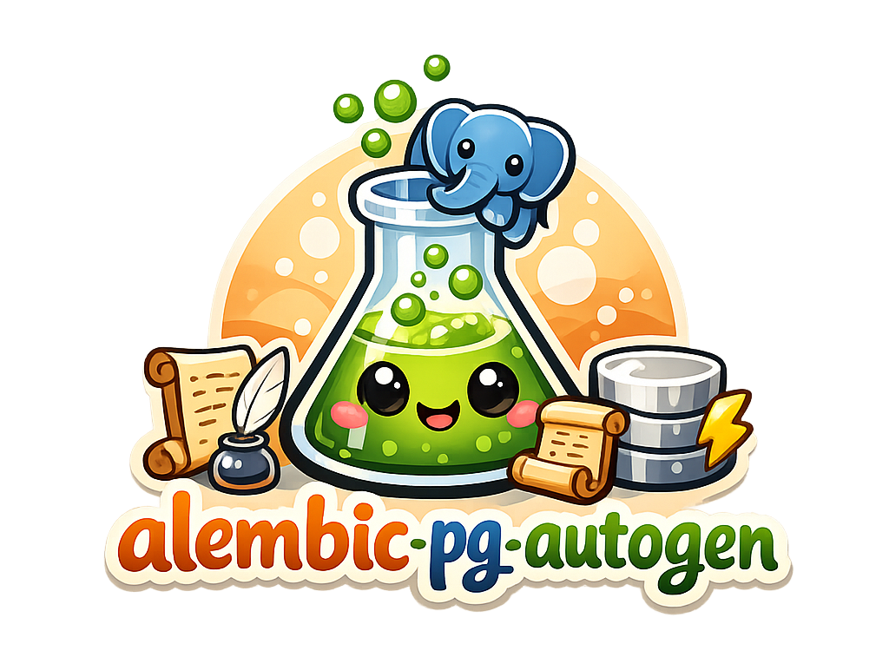

# alembic-pg-autogen

[](https://pypi.org/project/alembic-pg-autogen/)
[](https://pypi.org/project/alembic-pg-autogen/)
[](LICENSE)
[](https://github.com/eddieland/alembic-pg-autogen/actions/workflows/ci.yml)
[](https://codecov.io/gh/eddieland/alembic-pg-autogen)
[](https://alembic-pg-autogen.readthedocs.io)
[](https://pypi.org/project/alembic-pg-autogen/)

> **Status: Alpha** - the core pipeline works and is tested against real PostgreSQL, but the API may change before 1.0.

Alembic autogenerate extension for PostgreSQL functions and triggers. Declare your DDL strings and let
`alembic revision --autogenerate` figure out the `CREATE`, `DROP`, and `CREATE OR REPLACE` for you.

<p align="center">
  
</p>

## Background

[alembic_utils](https://github.com/olirice/alembic_utils) pioneered autogenerate support for PostgreSQL objects and has
been hugely helpful to the community. This project takes a different approach aimed at faster performance on large
schemas with many functions and triggers.

## How it works

You declare your desired functions and triggers as plain DDL strings. At autogenerate time, the extension inspects the
live database catalog, canonicalizes your DDL via a temporary savepoint, diffs current vs. desired state, and emits
migration ops in dependency-safe order.

## Quick example

```python
import alembic_pg_autogen  # noqa: F401  # registers the comparator plugin

PG_FUNCTIONS = [
    """
    CREATE OR REPLACE FUNCTION audit_trigger_func()
    RETURNS trigger LANGUAGE plpgsql AS $$
    BEGIN
        NEW.updated_at = now();
        RETURN NEW;
    END;
    $$
    """,
]

# in run_migrations_online():
context.configure(
    connection=connection,
    target_metadata=target_metadata,
    pg_functions=PG_FUNCTIONS,
)
```

```bash
alembic revision --autogenerate -m "add audit function"
```

## Installation

```bash
pip install alembic-pg-autogen
```

Requires Python 3.10+ and SQLAlchemy 2.x. Bring your own PostgreSQL driver (`psycopg`, `psycopg2`, `asyncpg`, etc.).
This package depends on [postgast](https://pypi.org/project/postgast/) for DDL parsing, which requires
`protobuf >= 5.27`.

## Documentation

Full documentation is available at [alembic-pg-autogen.readthedocs.io](https://alembic-pg-autogen.readthedocs.io),
including a quick-start guide, migration instructions for alembic_utils users, and API reference.

## Development

```bash
make install     # Install dependencies (uses uv)
make lint        # Format (mdformat, codespell, ruff) then type-check (basedpyright)
make test        # Run full test suite (requires Docker for integration tests)
make test-unit   # Run unit tests only (no Docker needed)
```

## License

[MIT](LICENSE)
